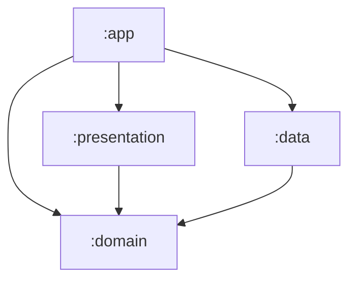

  

## 📋 프로젝트 개요

* **기반 통화**: 미국 달러 (USD)
* **대상 통화**: 한국(KRW), 일본(JPY), 필리핀(PHP)
* **API**: Currency Layer API (`http://apilayer.net/api/live`)
* **주요 기능**: 실시간 환율 정보 조회, 수취 금액 계산, 입력값 유효성 검사

## 🛠️ 기술 스택 (Tech Stack)

### Architecture & Design Pattern
* **Clean Architecture**: Presentation, Domain, Data 계층 분리
* **Multi-Module**: `:app`, `:presentation`, `:domain`, `:data`, `:build-logic`
* **MVVM**: UI와 비즈니스 로직의 분리

### Libraries
* **UI**: Jetpack Compose (Material3)
* **DI**: Hilt
* **Network**: Retrofit2, OkHttp3
* **Serialization**: Moshi
* **Concurrency**: Coroutines, Flow
* **Testing**: JUnit4, Mockk, Turbine

### Build System
* **Gradle Kotlin DSL**
* **Version Catalog** (`libs.versions.toml`)
* **Convention Plugins** (`build-logic` 모듈을 통한 빌드 로직 중앙화)

## 🏛 아키텍처 구조 (Module Structure)



| 모듈 | 설명 | 주요 구성 요소 |
|---|---|---|
| **:app** | 애플리케이션의 진입점 | `Hilt` 설정, `Application` 클래스 |
| **:presentation** | UI 및 화면 로직 담당 | `Activity`, `Compose UI`, `ViewModel`, `UiState` |
| **:domain** | 순수 비즈니스 로직 (Android 의존성 없음) | `UseCase`, `Model`, `Repository Interface` |
| **:data** | 데이터 처리 및 API 통신 | `Repository Impl`, `API Service`, `DTO`, `Mapper` |
| **:build-logic** | 공통 빌드 설정 관리 | `Convention Plugin` (Gradle 설정 재사용) |

## ✨ 주요 기능 구현

### 1. Interceptor를 통한 공통 파라미터 처리
* **구현 내용**: `OkHttp`의 `Interceptor`를 구현하여 네트워크 요청을 가로채고 처리합니다.

```kotlin
// data/api/ExchangeAuthInterceptor.kt
class ExchangeAuthInterceptor @Inject constructor(
    @Named("apiKey") private val apiKey: String
) : Interceptor {
    override fun intercept(chain: Interceptor.Chain): Response {
        val originalRequest = chain.request()
        val originalUrl = originalRequest.url

        val newUrl = originalUrl.newBuilder()
            .addQueryParameter(QUERY_ACCESS_KEY, apiKey)
            .addQueryParameter(QUERY_CURRENCIES, DEFAULT_CURRENCIES)
            .addQueryParameter(QUERY_SOURCE, DEFAULT_SOURCE)
            .addQueryParameter(QUERY_FORMAT, DEFAULT_FORMAT)
            .build()

        val newRequest = originalRequest.newBuilder()
            .url(newUrl)
            .build()

        return chain.proceed(newRequest)
    }
}
```

### 2. Flow 기반 비동기 데이터 스트림 관리
* **구현 내용**: `Flow`를 활용하여 Repository에서 ViewModel까지 이어지는 비동기 데이터 파이프라인을 구축했습니다.<br/>
  `ApiResult`(`Loading`, `Success`, `Error`)를 정의하여 데이터 요청 결과의 상태 변화를 `Flow`를 통해 UI 계층으로 전달합니다.

```kotlin
// data/repository/ExchangeRepositoryImpl.kt
override fun getExchangeRates() = flow {
    emit(ApiResult.Loading)
    val response = exchangeApi.getExchangeRates()
    
    if (response.success) {
        emit(ApiResult.Success(response.toDomain()))
    } else {
        emit(ApiResult.Error(response.error?.info ?: "잠시 후 다시 시도해주세요."))
    }
}.catch { e ->
    emit(ApiResult.Error(e.message ?: "잠시 후 다시 시도해주세요."))
}.flowOn(Dispatchers.IO) // IO 스레드에서 실행
```

### 3. UiState 패턴
* **구현 내용**: 화면의 상태를 정의하는 `UiState<T>` 데이터 클래스를 설계하여 `isLoading`(로딩), `data`(실제 데이터), `errorMessage`(에러)를 하나의 객체로 캡슐화했습니다.

```kotlin
data class UiState<T>(
    val isLoading: Boolean = false,
    val data: T,
    val errorMessage: String? = null
)
```

## 🔗 참고 자료

- [CurrencyLayer API 문서](https://currencylayer.com/documentation)
- [Android Clean Architecture](https://developer.android.com/topic/architecture)
- [Jetpack Compose](https://developer.android.com/jetpack/compose)
- [Hilt Dependency Injection](https://developer.android.com/training/dependency-injection/hilt-android)
- SeSAC 강의 자료